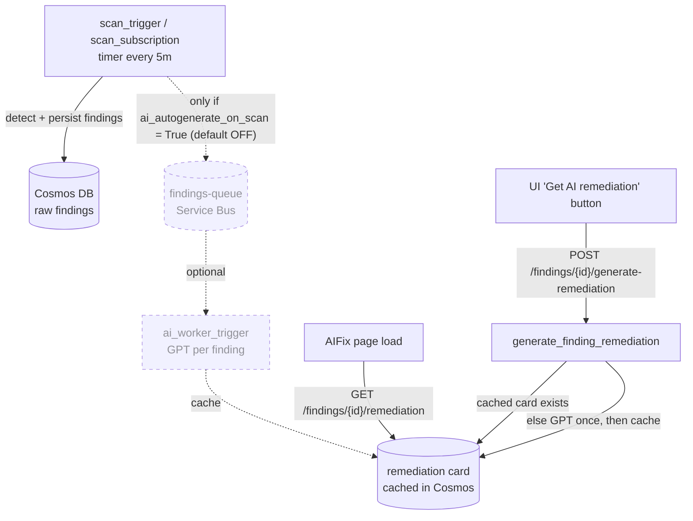

# AI Remediation Flow (On-Demand)

CloudGuardIQ generates AI remediation cards **on demand** rather than eagerly on
every scan. Scheduled scans still detect and persist every finding, but they no
longer spend Azure OpenAI tokens pre-generating a remediation card for each one.
A card is produced only when a user explicitly asks for it.

## Why

Eager generation pushed *every* finding from *every* scan onto the
`findings-queue`, so `ai_worker_trigger` ran one GPT call per finding per scan
(~109K invocations / ~41s each over 30 days). That is the single largest source
of compute and token spend, and most cards were never viewed.

## Flow

**Solid path = default (on demand).** The dashed path is the legacy eager
fan-out, now gated behind a flag and disabled by default.

## Entry points

1. **On-demand generation (default):** the "Get AI remediation" button in
   [FindingDetailPanel.tsx](../frontend/src/components/findings/FindingDetailPanel.tsx)
   navigates to the AI Fix page, which calls
   `POST /findings/{id}/generate-remediation`
   ([main.py](../cloudguardiq/api/main.py)). That endpoint checks the AI quota,
   returns the cached card if one exists, otherwise calls GPT **once**, caches
   the card, and records usage.
2. **Cached lookup on page load:** [AIFix.tsx](../frontend/src/pages/AIFix.tsx)
   issues `GET /findings/{id}/remediation` when the page opens. This only
   *reads* a previously generated card and never triggers GPT; if no card
   exists, the page shows an explicit **Generate AI remediation** button.
3. **Scheduled eager generation (optional, OFF by default):** when
   `ai_autogenerate_on_scan = True`, `ScanPipeline.run` queues findings onto the
   Service Bus so `ai_worker_trigger` pre-generates cards. Leave this off unless
   you specifically want every finding pre-enriched and accept the token cost.

## The `ai_autogenerate_on_scan` flag

- Defined in [config.py](../cloudguardiq/core/config.py) as
  `ai_autogenerate_on_scan: bool = False`.
- Wired into the pipeline in
  [function_app.py](../function_app.py) via
  `auto_generate_ai=settings.ai_autogenerate_on_scan`.
- When `False` (default), `ScanPipeline.run` skips `_queue_findings` entirely
  and logs that AI auto-generation is disabled; raw findings are still saved.
- Set it `True` per environment (env var `AI_AUTOGENERATE_ON_SCAN=true`) to
  restore the eager behaviour without code changes.
