# CloudGuardIQ — FinOps Cost Flow

> **Audience:** Executive / C-Suite + Engineering
> **Purpose:** Explain exactly how CloudGuardIQ turns a customer's live cloud
> bill into trustworthy per-resource cost, waste findings, and rightsizing
> savings — across Azure, AWS, and GCP — end to end.

---

## 1. The Big Picture (60-second version)

Security tells you what is *risky*. FinOps tells you what is *wasteful*.
CloudGuardIQ attaches a **real dollar figure** to every resource on every scan,
so a single pass surfaces cost waste right next to security risk. It does this in
four moves:

1. **Resolve** a clean billing window (one closed calendar month — no partial-
   month skew).
2. **Price** every resource — first from the customer's **actual bill**, falling
   back to the **public list price** when the bill is not yet available.
3. **Estimate savings** — rightsizing deltas computed from *live* prices, not
   flat guesses.
4. **Stamp & surface** — tag each resource with its data tier and feed the FinOps
   rule engine, the dashboard, and AI remediation.

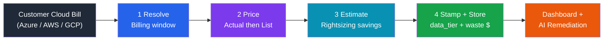

**Key business design principle:** cost is **enrichment, never a hard
dependency**. If a billing or pricing API is throttled, unauthorized, or down,
the lookup degrades to an empty result and the scan still completes — no crash,
no blank dashboard.

### What shipped — the FinOps maturity stack (5 phases)

CloudGuardIQ's FinOps capability landed in five incremental phases. The first two
sit inside the **scan pipeline** (per-resource cost + waste). The last three are a
pure **analytics layer** over a normalized cost ledger (FOCUS), exposed as its own
`/finops/*` API and UI — none of it depends on Microsoft Defender for Cloud.

| Phase | Theme | What it added | Where it lives |
|-------|-------|---------------|----------------|
| **1 — FOCUS ingestion** | A common cost ledger | FinOps-FOCUS-normalized billing rows for Azure/AWS/GCP, the `CostProvider` seam, the `focus_costs` container | `billing/cost_provider.py`, `core/models.py` (`FocusCostRecord`) |
| **2 — Utilization + rightsizing** | Idle / oversized detection | Utilization metrics providers + idle/rightsizing activation feeding the FinOps rules | `billing/*_metrics_provider.py`, `adapters/rules/azure/finops.py` |
| **3 — Native recommenders** | The cloud's own advice | Azure Advisor / AWS / GCP recommender adapters merged into the scan as **DIRECT** savings | `adapters/recommenders/*` |
| **4 — Coverage + forecasting** | Commitments & trend | Commitment coverage/utilization analysis and day-of-week spend forecasting | `finops/commitments.py`, `finops/forecasting.py` |
| **5 — Operate** | Allocation, budgets, anomalies, unit economics | Showback/chargeback + tag coverage, budgets (actual & forecast vs target), statistical anomaly alerting, cost-per-unit | `finops/allocation.py`, `finops/budgets.py`, `finops/anomaly.py`, `finops/unit_economics.py` |

> **Sections 2–7** below cover the in-pipeline cost flow (phases 1–2). **Sections
> 8–14** cover the analytics layer (phases 3–5).

---

## 2. The CostProvider Seam — One Contract, Three Clouds

Exactly like `AdapterBase` is the only thing allowed to touch cloud *inventory*
APIs, **`CostProvider` is the only thing allowed to touch cloud *billing /
pricing* APIs.** Every cloud implements the same two-method contract, so the
adapters, rules, and dashboard stay provider-agnostic.

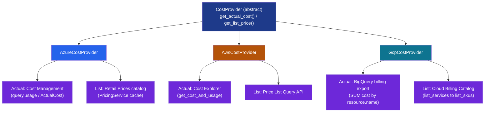

The base class (`cloudguardiq/billing/cost_provider.py`) owns all the
cross-cutting behaviour so no provider re-implements it:

| Public method | Returns | On empty input | On any failure |
|---------------|---------|----------------|----------------|
| `get_actual_cost(ids, window=...)` | `{resource_id -> monthly USD}` | `{}` (short-circuit) | `{}` + warning log |
| `get_list_price(sku, region, default=...)` | monthly USD `float` | — | `default` / `0.0` + warning log |

> Resource ids are lower-cased on the way out so every cloud compares cleanly.
> Each subclass only implements the two protected `_fetch_*` template methods.

---

## 3. Two Price Signals, Two Data Tiers

CloudGuardIQ deliberately distinguishes **what was actually billed** from **what
the catalog says a SKU costs**. They map onto the project's data-tier model so
the dashboard can show how trustworthy each number is.

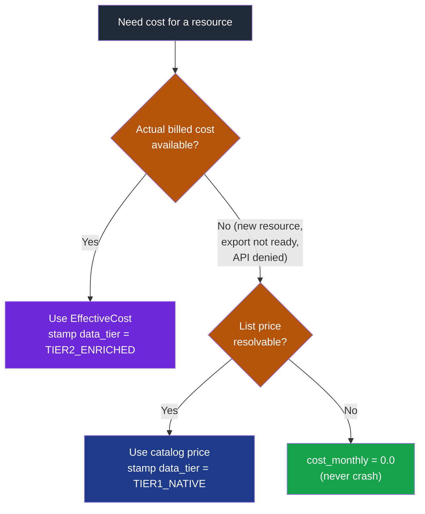

| Signal | Source per cloud | Meaning | Data tier |
|--------|------------------|---------|-----------|
| **Actual cost** | Azure Cost Management · AWS Cost Explorer · GCP BigQuery export | Real billed / effective spend — authoritative | **Tier 2 — Enriched** |
| **List price** | Azure Retail Prices · AWS Price List · GCP Cloud Billing Catalog | Public catalog price — strong lower bound | **Tier 1 — Native** |

> **No dollar amount is ever hardcoded** in an adapter or rule. Every figure is
> pulled live from a billing or pricing API. The bundled static catalog exists
> only as a **logged, offline last resort** inside the providers.

---

## 4. The Billing Window — Apples-to-Apples Across Clouds

Every cost figure is anchored to a precise, well-defined billing window so the
numbers mean exactly the same thing on Azure, AWS, and GCP. `CostWindow` is the
**single source of truth** for date math, shared by all three clouds, so spend is
measured over the same period everywhere and is directly comparable.

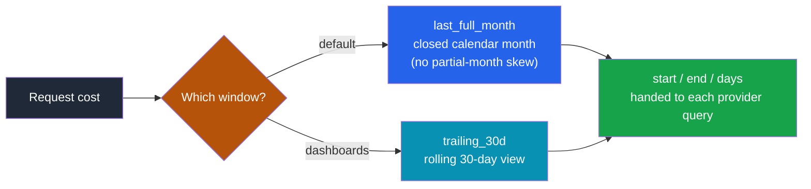

- Hourly meters (VMs, public IPs, disks priced per-GiB) are converted to monthly
  with the shared constant **`HOURS_PER_MONTH = 730.0`**, identical across clouds.
- The window is `frozen` and resolved from an injectable `now`, so tests are
  deterministic.

---

## 5. How Each Cloud Computes Cost

All three providers share the same shape: **actual cost grouped by resource id**,
**list price decoded from a logical SKU key**, and **graceful degradation** on
every external call.

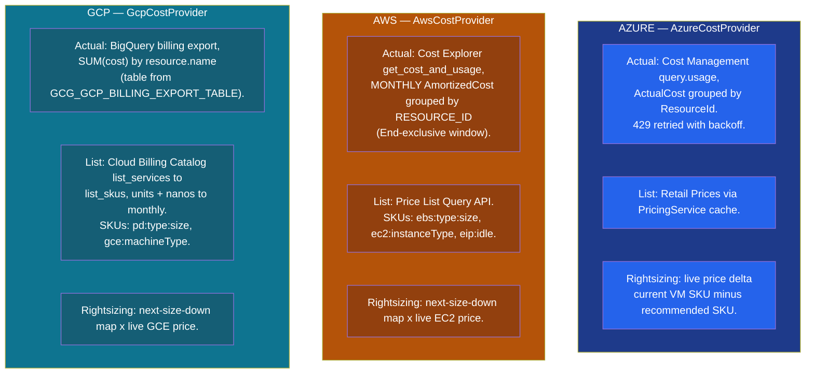

| Concern | Azure | AWS | GCP |
|---------|-------|-----|-----|
| **Actual cost API** | Cost Management `query.usage` (ActualCost) | Cost Explorer `get_cost_and_usage` | BigQuery billing export |
| **Group key** | `ResourceId` | `RESOURCE_ID` | `resource.name` |
| **List price API** | Retail Prices (PricingService) | Price List Query API | Cloud Billing Catalog |
| **Compute SKU key** | VM SKU | `ec2:<instanceType>` | `gce:<machineType>` |
| **Disk SKU key** | disk SKU | `ebs:<type>:<gb>` | `pd:<type>:<gb>` |
| **Idle / misc** | — | `eip:idle` | — |
| **Throttling** | 429 retried w/ backoff | guarded executor → `[]` | guarded query → `{}` |

---

## 6. Where Cost Attaches to a Scan — `_enrich_costs`

After inventory is discovered, each adapter runs a single `_enrich_costs` pass
over the cost-relevant resource types (VMs / instances and disks). This is the
one place the adapter calls its `CostProvider`.

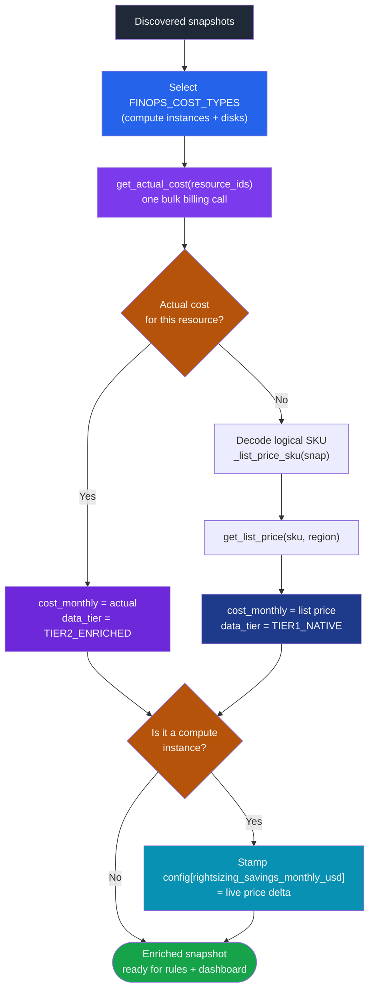

- **Actual cost is preferred**; list price is the fallback so a brand-new
  resource (no billing history yet) still gets a credible number.
- Rightsizing savings land in `config["rightsizing_savings_monthly_usd"]`, which
  the FinOps rules read to produce waste findings and the dashboard sums into
  "waste $ identified".

---

## 7. Rightsizing — Savings From Live Price Deltas

Rightsizing savings are grounded in real catalog economics. Each provider
computes savings as the **actual price difference** between the current SKU and
the recommended next-size-down SKU, both priced live — a defensible, finance-ready
number rather than a rule-of-thumb estimate.

$$ \text{Savings}_{\text{monthly}} = \text{Price}(\text{current SKU}) - \text{Price}(\text{next size down}) $$

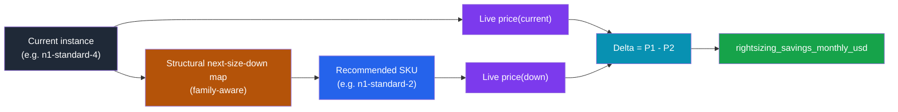

| Cloud | Recommendation map | Priced via |
|-------|--------------------|-----------|
| **Azure** | VM SKU → smaller VM SKU | Retail Prices delta |
| **AWS** | `_EC2_NEXT_SIZE_DOWN` (t3 / m5 / c5 / r5 families) | Price List delta |
| **GCP** | `_GCE_NEXT_SIZE_DOWN` (n1 / n2 / e2 / c2 families) | Catalog delta |

> If either price is unavailable the savings simply isn't stamped — the resource
> still keeps its cost. Degradation never produces a misleading number.

---

## 8. Native Recommenders — DIRECT Savings From the Cloud's Own Advisor

Phases 1–2 derive savings from **our** price math (sections 6–7). Phase 3 also
ingests the cloud provider's **own** optimization advice — Azure Advisor, AWS
Cost Optimization Hub / Compute Optimizer, GCP Recommender — and merges those
findings into the same scan. Because the number comes straight from the
provider, it is stamped as a **DIRECT** savings signal (highest confidence),
versus the **ESTIMATED** numbers our own heuristics produce.

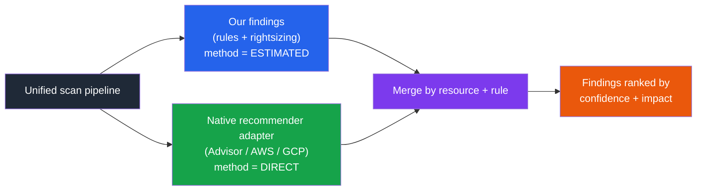

Every `FindingResult` carries two FinOps trust fields so the dashboard and
finance can weight a number by how it was derived:

| `finops_method` | Meaning | `finops_confidence` |
|-----------------|---------|---------------------|
| `DIRECT` | Provider's own recommendation / billed figure | HIGH |
| `ESTIMATED` | CloudGuardIQ heuristic (rightsizing delta, anomaly excess) | MEDIUM |
| `NONE` | Governance finding, no dollar claim | LOW |

> Recommender APIs are wrapped like every other external call — an Advisor
> outage drops the DIRECT enrichment and the scan keeps our ESTIMATED findings.

---

## 9. The FOCUS Ledger — One Normalized Cost Table for Every Cloud

The analytics layer never queries a cloud directly. It reads one normalized
table: **`FocusCostRecord`** rows (FinOps Open Cost & Usage Specification)
persisted in the `focus_costs` Cosmos container, partitioned by `/tenant_id`.
Azure, AWS, and GCP bills are all flattened into the same shape, so allocation,
budgets, forecasting, and anomalies are written **once** and work for all three.

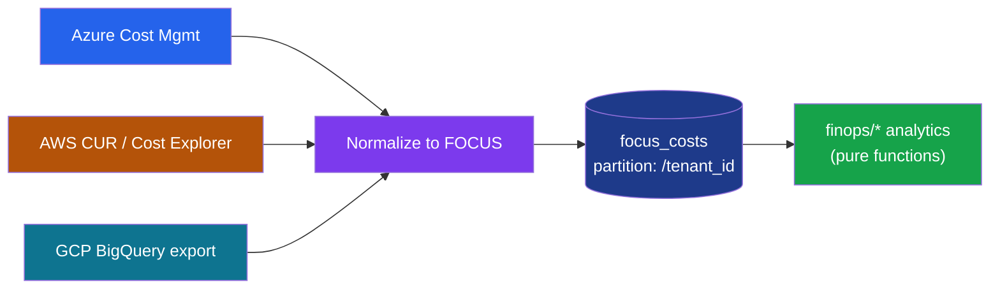

Key fields used downstream: `tenant_id`, `sub_account_id` (Azure sub / AWS
account / GCP project), `billing_period`, `charge_period_start`, `charge_category`
(Usage / Purchase / …), `effective_cost`, `service_name` / `service_category`,
`commitment_discount_id`, and `tags` (the allocation dimensions). Every analytics
function in `cloudguardiq/finops/` is a **pure function over these rows** — no
cloud SDK, no I/O — which is why they are fully unit-tested and degrade to empty
results when the ledger is unavailable.

---

## 10. Commitment Coverage & Utilization (Phase 4)

`finops/commitments.py` answers two reservation questions from FOCUS rows:
**coverage** ("what share of eligible compute is covered by a Reservation /
Savings Plan / CUD?") and **utilization** ("of what we committed to and paid for,
how much did we actually use?").

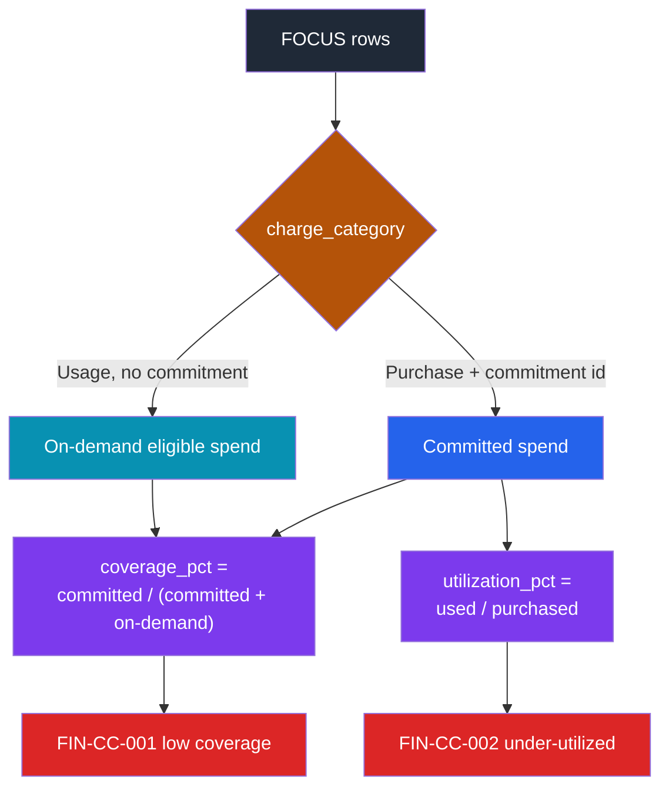

- **`FIN-CC-001`** fires when coverage is below target and there is meaningful
  on-demand-eligible spend — savings estimated as `eligible × assumed discount`.
- **`FIN-CC-002`** fires when a specific commitment is utilized below the 85%
  floor (severity escalates below 50%).
- Surfaced at **`GET /finops/coverage`** as a `CommitmentCoverageSummary`.

---

## 11. Spend Forecasting (Phase 4)

`finops/forecasting.py` projects month-end and next-month spend from the daily
FOCUS series using a **trailing daily average modulated by a day-of-week
seasonality factor** — deterministic and explainable, not a black box.

$$ \text{projected month-end} = \text{MTD} + \sum_{\text{remaining days}} \text{trailing avg} \times \text{seasonality}(\text{weekday}) $$

A forecast can be computed per `sub_account`, per `service`, or per `tag:<key>`,
which is exactly what budgets (section 13) reuse to project a breach. Surfaced at
**`GET /finops/forecast`** as a list of `SpendForecast` (trailing avg, MTD,
projected month-end, projected next-month).

---

## 12. Allocation — Showback / Chargeback & Tag Coverage (Phase 5)

`finops/allocation.py` groups spend by an allocation **dimension** (an allocation
tag such as `team`, `app`, `environment`, or `cost_center`, with case-insensitive
synonym matching) and measures how much spend can actually be attributed.

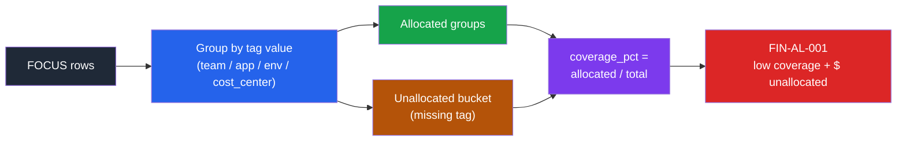

- **`allocate_spend(dimension)`** → `AllocationSummary` (groups, allocated vs
  unallocated, coverage %). Surfaced at **`GET /finops/allocation`**.
- **`compute_tag_coverage()`** → cost-weighted coverage per default dimension.
  Surfaced at **`GET /finops/coverage-tags`**.
- **`FIN-AL-001`** is a *governance* finding (no dollar claim, `method = NONE`)
  raised when coverage is below target **and** unallocated spend clears a floor —
  generalizing the old per-resource `MissingCostTags` rule into an account metric.

---

## 13. Budgets, Anomalies & Unit Economics — the "Operate" Layer (Phase 5)

The final phase reaches FinOps "Operate" maturity with three more pure-model
capabilities over the FOCUS ledger.

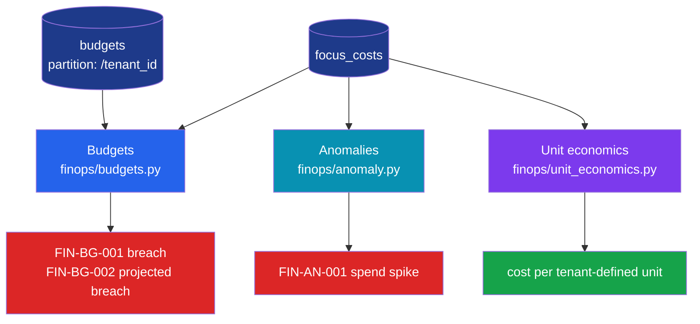

- **Budgets** — a `Budget` (scoped to whole subscription, a service, or a tag
  value) is evaluated for month-to-date actual **and** a projected month-end
  (reusing the section-11 forecast). Status is `OK` → `WARN` (over threshold) →
  `BREACH` (actual over) → `PROJECTED_BREACH` (forecast over), emitting
  `FIN-BG-001` / `FIN-BG-002`. CRUD at **`POST/GET/DELETE /finops/budgets`**;
  evaluation at **`GET /finops/budgets/status`**.
- **Anomalies** — a rolling mean/standard-deviation baseline (default 14-day
  window, min 7 periods) flags days whose spend exceeds a z-score threshold;
  severity scales with deviation (z≥3 MEDIUM, ≥4 HIGH, ≥5 CRITICAL), emitting
  `FIN-AN-001`. Surfaced at **`GET /finops/anomalies`**.
- **Unit economics** — divides MTD and projected spend by a tenant-defined
  denominator (active customers, transactions, …) to express cost efficiency.
  Surfaced at **`GET /finops/unit-economics`**.

---

## 14. Data Stores & API Surface

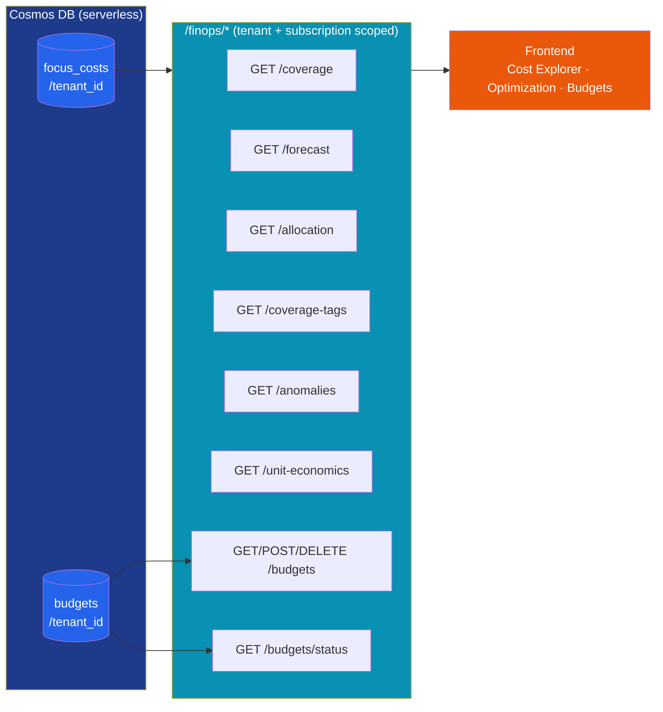

- **Containers** are provisioned by Terraform (`infra/main.tf`), not auto-created
  by the app: `focus_costs` (phase 1) and `budgets` (phase 5), both partitioned
  by `/tenant_id`.
- **Every `/finops/*` endpoint is tenant- and subscription-scoped** and degrades
  gracefully: no subscription, missing repository, or a Cosmos error returns an
  empty / zeroed payload (or `[]`) instead of erroring.
- **Frontend:** the React app surfaces this via the **Cost Explorer**,
  **Optimization** (allocation, tag coverage, anomalies, unit economics), and
  **Budgets** pages, all backed by `frontend/src/api/finops.ts`.

---

## 15. The Guards (where cost degrades safely)

Every external billing/pricing touchpoint is wrapped. Failure is expected and
handled — it is never allowed to crash a scan or blank the dashboard.

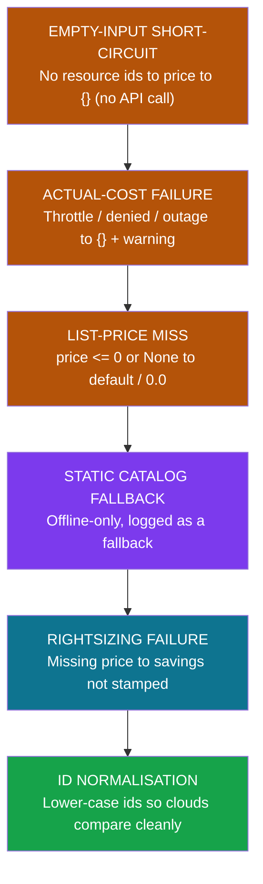

| Guard | Stage | Effect | Business rationale |
|-------|-------|--------|--------------------|
| **Empty-input short-circuit** | Entry | No ids → `{}`, zero API calls | Speed; no wasted billing quota |
| **Actual-cost graceful fail** | Billing API | Outage → `{}` + warning | Cost is enrichment, never a blocker |
| **List-price miss handling** | Pricing API | `<= 0` / `None` → default | A bad price never poisons the dashboard |
| **Static catalog fallback** | Pricing API | Logged offline last resort | Works air-gapped; never silently authoritative |
| **Rightsizing fail-safe** | Estimate | Missing price → no stamp | No misleading savings claims |
| **Id normalisation** | Exit | Lower-case ids | Correct cross-cloud joins |

---

## 16. One-Page Executive Summary

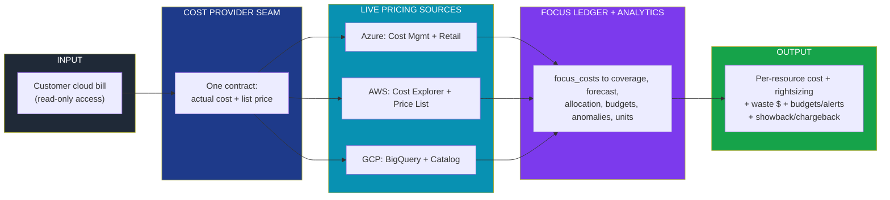

**Bottom line for the business:**
- Every resource carries a **real dollar figure** sourced live from the cloud
  bill — no hardcoded prices.
- One clean **billing window** makes Azure, AWS, and GCP numbers directly
  comparable.
- **Actual-first, list-price-fallback** means even brand-new resources get a
  credible cost.
- **Rightsizing savings are real price deltas** — and where the cloud's own
  advisor agrees, the number is stamped **DIRECT** (highest confidence).
- **From cost to decisions** — one FOCUS ledger powers commitment coverage,
  spend forecasting, showback/chargeback allocation, budgets with breach alerts,
  anomaly detection, and unit economics, identically across Azure, AWS, and GCP.
- **Trustworthy by design** — every billing/pricing/analytics call is tenant- and
  subscription-scoped and degrades gracefully, so an outage never crashes a scan
  or blanks the dashboard.
