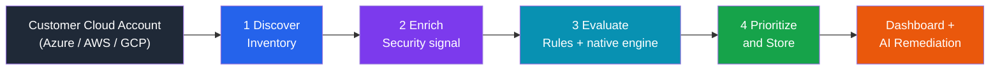
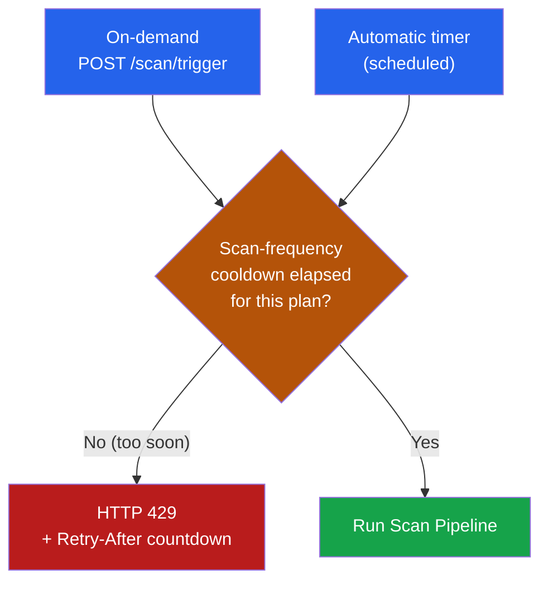
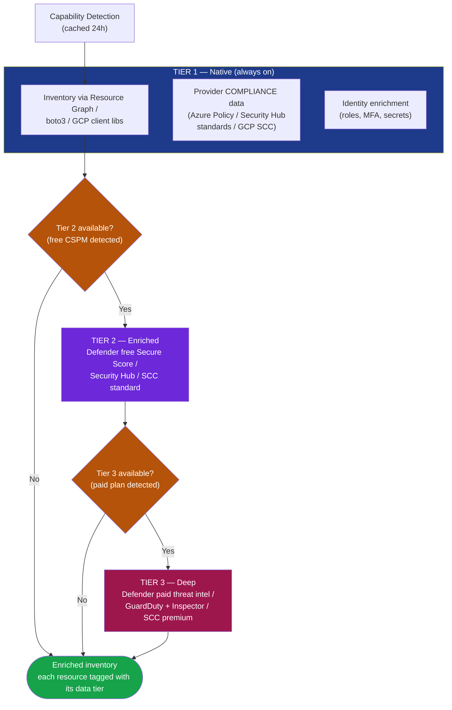
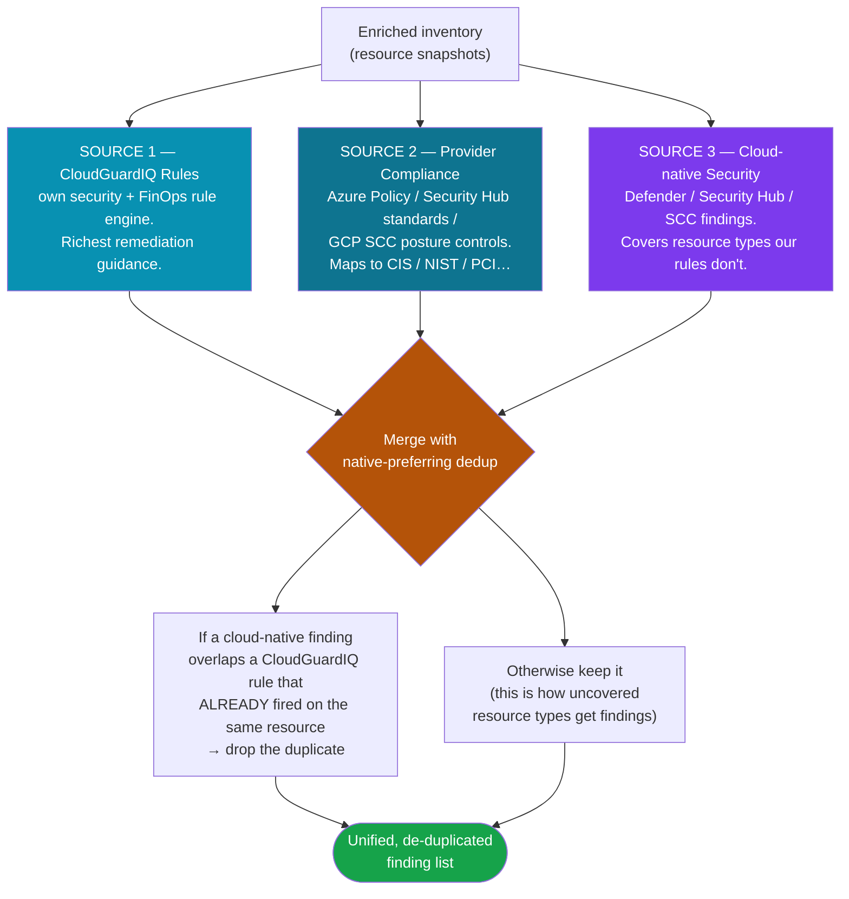
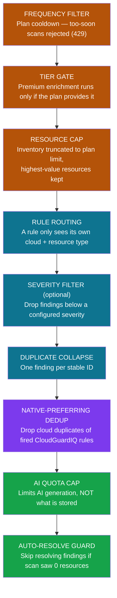
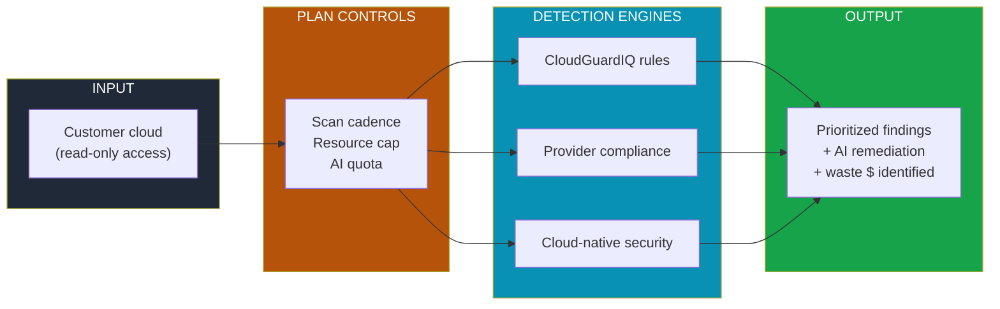

# CloudGuardIQ — Scan Process Flow

> **Audience:** Executive / C-Suite + Engineering
> **Purpose:** Explain exactly how CloudGuardIQ scans cloud resources, how the
> subscription (billing) plan shapes each scan, and how security & cost
> findings are produced — end to end.

---

## 1. The Big Picture (60-second version)

CloudGuardIQ turns a customer's live cloud account into a prioritized list of
**security risks** and **cost-waste findings** on every scan. It does this in
four moves:

1. **Discover** every resource (servers, storage, databases, identities…).
2. **Enrich** that inventory with deeper security signal *when the customer's
   cloud plan offers it* — at no extra charge.
3. **Evaluate** everything against CloudGuardIQ's own rule engine **plus** the
   cloud provider's native security engine.
4. **Prioritize, store, and surface** the findings, ready for one-click AI
   remediation.

**Key business design principle:** CloudGuardIQ **never hard-depends** on a
paid cloud security product. A free-tier customer still gets a full scan; richer
plans simply layer *more* signal on top. Every premium data source degrades
gracefully — if it is unavailable or fails, the scan still completes.

---

## 2. What Triggers a Scan & How the Billing Plan Gates It

A scan starts either **on-demand** (user clicks "Scan") or on an **automatic
timer**. How *often* a customer is allowed to scan is set by their plan tier.

| Plan (tier) | Price | Scan cadence | Max resources / scan | AI remediations / mo | Cloud accounts |
|-------------|-------|--------------|----------------------|----------------------|----------------|
| **Free**       | $0   | Daily        | **100**       | 5         | 1         |
| **Starter (Pro)** | $49  | Hourly       | **1,000**     | 100       | 3         |
| **Enterprise** | $299 | Every 15 min | **Unlimited** | Unlimited | Unlimited |

> The plan catalog in `cloudguardiq/billing/plans.py` is the **single source of
> truth** for every number above. The cooldown check degrades *open* — a billing
> hiccup never blocks a legitimate scan.

---

## 3. The Full Scan Pipeline (detailed)

This is the authoritative end-to-end flow inside `ScanPipeline.run()`.

```mermaid
flowchart TD
    Start(["Scan starts"]) --> Price["Refresh pricing cache<br/>(24h TTL, best-effort)"]
    Price --> Scan["STEP 1 — Discover inventory<br/>adapter.scan()"]

    Scan --> Stamp["STEP 1a — Stamp tenant ID<br/>on every resource"]
    Stamp --> Cap{"STEP 1b — Inventory<br/>over plan cap?"}

    Cap -- "No" --> Eval
    Cap -- "Yes" --> Trunc["Keep highest-value resources:<br/>1) rule-covered first<br/>2) then highest monthly cost<br/>Drop the rest"]
    Trunc --> Eval

    Eval["STEP 2 — Evaluate native rules<br/>policy_engine.evaluate()"] --> Merge1["STEP 2b — Merge provider<br/>COMPLIANCE findings<br/>(Azure Policy / Security Hub<br/>standards / GCP SCC postures)"]
    Merge1 --> Merge2["STEP 2c — Merge cloud-native<br/>SECURITY findings<br/>(Defender / Security Hub / SCC)"]

    Merge2 --> Dedup["Collapse duplicates<br/>by stable finding_id"]
    Dedup --> Score["Compute priority score<br/>(0–100) for every finding"]

    Score --> AIgate{"STEP 3 — AI auto-generate<br/>enabled?"}
    AIgate -- "No (default)" --> Save
    AIgate -- "Yes" --> Queue["Queue findings for AI,<br/>highest priority first,<br/>capped by AI quota"]
    Queue --> Save

    Save["STEP 4 — Save findings<br/>to database"] --> Resolve{"Did scan find<br/>&gt; 0 resources?"}
    Resolve -- "Yes" --> Sweep["Auto-resolve findings<br/>not seen this scan"]
    Resolve -- "No (degraded scan)" --> Keep["Preserve existing findings<br/>(do NOT blank dashboard)"]

    Sweep --> Result
    Keep --> Result
    Result(["Return ScanResult summary:<br/>resources, findings,<br/>critical/high, waste $, duration"])

    style Start fill:#1f2937,color:#fff
    style Scan fill:#2563eb,color:#fff
    style Cap fill:#b45309,color:#fff
    style Trunc fill:#b45309,color:#fff
    style Eval fill:#0891b2,color:#fff
    style Merge1 fill:#0e7490,color:#fff
    style Merge2 fill:#7c3aed,color:#fff
    style AIgate fill:#b45309,color:#fff
    style Save fill:#16a34a,color:#fff
    style Resolve fill:#b45309,color:#fff
    style Result fill:#ea580c,color:#fff
```

---

## 4. How Resources Are Discovered — The Tier Model

Discovery is **tiered**. Tier 1 is always available to any read-only account.
Tiers 2 and 3 are *automatically detected* and layered on when the customer's
cloud plan provides them — they are a **free uplift**, never a CloudGuardIQ
paywall. Capability detection results are cached for 24 hours.

| Data tier | Azure | AWS | GCP | Cost to customer |
|-----------|-------|-----|-----|------------------|
| **Tier 1 — Native**   | Resource Graph        | boto3 inventory     | GCP client libs       | Always free      |
| **Tier 2 — Enriched** | Defender free CSPM    | Security Hub        | SCC Standard          | Free uplift      |
| **Tier 3 — Deep**     | Defender paid plans   | GuardDuty + Inspector | SCC Premium         | Customer's existing cloud spend |

> Every premium call is wrapped so a failure logs a warning and the scan
> continues with whatever tier succeeded — **graceful degradation always**.

---

## 5. How Findings Are Created — Three Independent Sources

A single scan produces findings from **three complementary engines**, then
merges them intelligently so the customer never sees noisy duplicates.

- **Source 1 — CloudGuardIQ rules** evaluate each resource snapshot. Rules are
  *routed by resource type*, so AWS rules never see Azure resources, etc.
- **Source 2 — Provider compliance** ingests the cloud's own authoritative
  per-control compliance verdicts (CIS, NIST 800-53, PCI-DSS, ISO, SOC2…).
- **Source 3 — Cloud-native security** ingests Defender / Security Hub / SCC
  findings as first-class results, so resource types *without* a CloudGuardIQ
  rule still surface real risks.

> **Why dedup matters (business value):** the customer sees **one** prioritized
> issue per real problem — with our richer fix guidance preferred — instead of
> the same risk reported three times.

---

## 6. The Filters & Guards (where things get dropped or held back)

Several deliberate controls shape what is scanned and what becomes a finding.

| Filter / guard | Stage | Effect | Business rationale |
|----------------|-------|--------|--------------------|
| **Scan-frequency cooldown** | Trigger | Rejects premature scans (HTTP 429) | Enforces plan tiers; protects infra |
| **Capability tier gate** | Discovery | Skips Tier 2/3 if unavailable | No hard dependency on paid security |
| **Resource cap** | Post-discovery | Truncates to plan limit, value-ordered | Fair usage; small tiers still scan what matters |
| **Cross-cloud rule routing** | Evaluation | Rule sees only its cloud + type | Correctness & performance |
| **Severity filter** | Evaluation | Optional minimum severity | Noise reduction when configured |
| **Duplicate collapse (by ID)** | Merge | One finding per stable ID | Stable dashboard counts |
| **Native-preferring dedup** | Merge | Drops cloud copies of fired rules | Best remediation guidance wins |
| **AI quota cap** | Queue | Limits AI generation only | Controls token spend; raw findings always saved |
| **Auto-resolve guard** | Save | No resolve sweep on 0-resource scan | A failed scan must not blank the dashboard |

---

## 7. How Findings Are Prioritized

Every finding gets a **priority score from 0–100** so the most important issues
rise to the top — and, on capped plans, are remediated first.

$$ \text{Priority} = 0.5 \times \text{Severity} + 0.3 \times \text{Cost} + 0.2 \times \text{Compliance} $$

| Component | How it's measured |
|-----------|-------------------|
| **Severity** (50%) | Critical = 100, High = 80, Medium = 60, Low = 40, Info = 20 |
| **Cost** (30%) | Monthly $ waste / impact, capped at 100 |
| **Compliance** (20%) | 25 points per mapped framework (CIS, NIST…), capped at 100 |

> On Free / Starter plans, when AI remediation is queued it is sent
> **highest-priority-first**, so a capped tenant still gets automated fixes for
> the issues that matter most.

---

## 8. One-Page Executive Summary

**Bottom line for the business:**
- Works on **any** cloud account from day one — no paid security product required.
- **Pays for itself** by surfacing cost waste alongside security risk in one scan.
- **Plan tiers scale cleanly** on resources, scan frequency, and AI usage.
- **Trustworthy by design** — graceful degradation, stable counts, and a guard
  that never wrongly clears a customer's dashboard.
